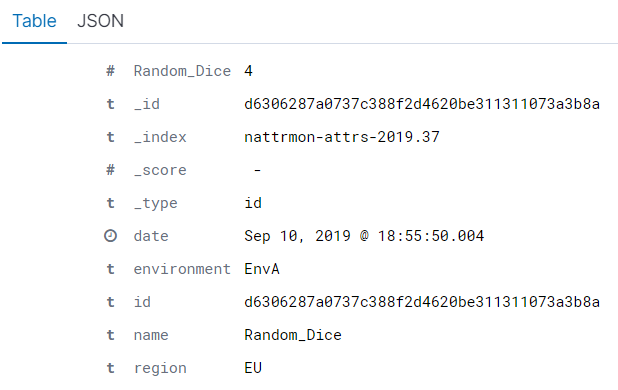
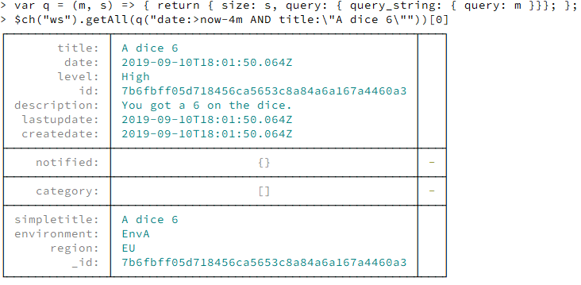

# Using ElasticSearch with nAttrMon

[nAttrMon](https://github.com/openaf/nattrmon) captures monitoring inputs to be validated and output to where deem necessary. But you start having more than one instance or you are monitoring a lot of inputs you start having the need to build specific dashboards, visualizations, etc. 

Additionally althougth nAttrMon lets you store input history, it's limited since it's not intended to be used for longer than a couple of days.

For all these challenges output and use [ElasticSearch](https://www.elastic.co/products/elasticsearch) & [Kibana](https://www.elastic.co/products/kibana) provide you the answer:
  * Elasticsearch let's you store more than just a couple of days of nAttrMon's input
  * Kibana let's you visualize the data anyway you want from ElasticSearch.

## How to set it up

So how to get nAttrMon to output to ElasticSearch? Simply create a new output (example in YAML):

````yaml
output:
  name         : Output ES values
  chSubscribe  : nattrmon::cvals
  waitForFinish: true
  onlyOnEvent  : true
  execFrom     : nOutput_ES
  execArgs     : 
    url      : http://127.0.0.1:9200
    #user     : nouser
    #pass     : nopass
    #considerSetAll: false 
    #funcIndex: "ow.ch.utils.getElasticIndex('nattrmon-attrs',\"yyyy.ww\")" 
    ## note: Check getElasticIndex function, If a specific format is needed you can provide it as aFormat (see ow.format.fromDate)"
    funcIndex: "ow.ch.utils.getElasticIndex('nattrmon-attrs', 'yyyy.ww')"
    #index: nattrs
    stampMap : 
      environment: EnvA
      region     : EU
    #include  :
    #  - test/test 1
    # exclude  :
````

In most of the cases you only need to specify the ElasticSearch URL. But there are more parameters:

| execArg | Description |
|---------|-------------|
| index | The ElasticSearch index where to store the current values (channel nattrmon::cvals). |
| funcIndex | In most of the cases you want to use a different ElasticSearch index on different times. You can specify a function for that. |
| considerSetAll | The nOutput_ES is based on channel subscription (chSubscribe) so it can potential receive a setAll operation. In case you use nAttrMon channel buffers you need to set this argument to true. Otherwise you are probably fine with false. |
| stamp | Since you might have several nAttrMon's instances dumping attribute values to the same ElasticSearch index you can "stamp" each output entries with specific entries (e.g. in the example environment and region) |
| include | You can specify that only some attributes' values will be sent to ElasticSearch. |
| exclude | Or you can specifiy that only some attributes' values shouldn't be sent to ElasticSearch. |
| user | The user credential if needed. |
| pass | The password credential if needed. |

Since in most ElasticSearch configuration cases it's advisable to have different indexes per time you can provide nAttrMon with a function on **funcIndex**. Using the helper function _ow.ch.utils.getElasticIndex_:

````javascript
ow.ch.utils.getElasticIndex('nattrmon-attrs', 'yyyy.ww')
````

## How the output looks in ElasticSearch?

For each attribute value change a new entry will be created in ElasticSearch: 



The key is _id_ and it's a hash. Then you will have the _name_ of the attribute and the _date_ it was checked. The value will be in a key with the same name as the attribute. If the attribute has _categories_ the '/' will be converted to a '_'. In the example above: _Random_Number_ and _Random_Dice_. The stamp keys will also, of course, be part of the ElasticSearch entry.

## And the warnings?

To add warnings just create a new similar output changing it's name, the ElasticSearch index where the warnings will be kept and replace on the chSubscribe to use _nattrmon::warnings_ instead of _nattrmon::cvals_.

 
_Example of an OpenAF channel accessing the ElasticSearch's nattrmon-warns index_

The warnings instead of the name of the attribute have the title of the warning, level (e.g. High, Medium, Low, Info, Closed), the description, the date of the last update and date of creation. The stamp map will also be part of the ElasticSearch entry as expected.


_Example of a kibana dashboard using sample warnings from nAttrMon_